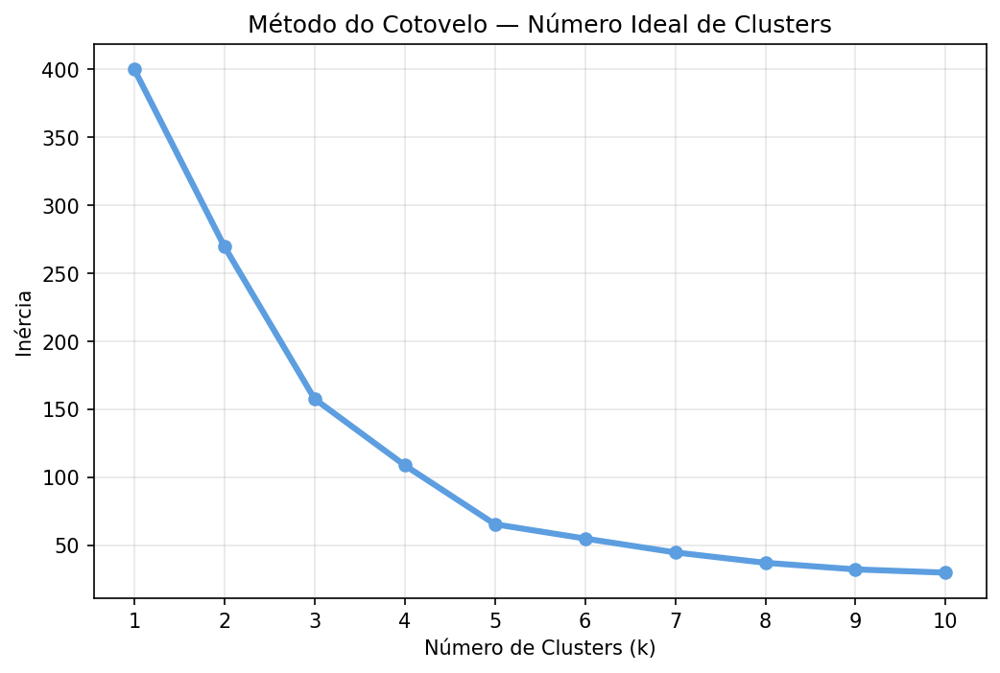
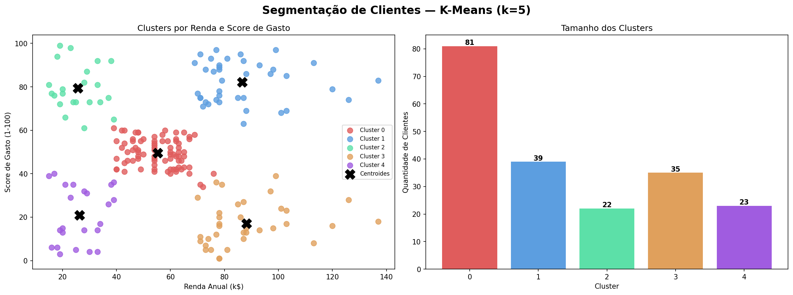

# 🛍️ Segmentação de Clientes — K-Means

Agrupamento de clientes de um shopping em 5 perfis distintos usando K-Means, com base em renda anual e score de gasto. Projeto com aplicação direta em estratégias de marketing e fidelização.

## Como foi feito

Os dados foram padronizados com StandardScaler para equalizar a escala entre renda e score — necessário porque o K-Means usa distância euclidiana. O número ideal de clusters foi definido pelo método do cotovelo, que identificou k=5 como o ponto onde adicionar mais grupos deixa de trazer ganho relevante.

## Base de dados

Dataset real de clientes de um shopping com 200 registros:

| Variável | Descrição |
|---|---|
| Annual Income (k$) | Renda anual em milhares de dólares |
| Spending Score (1-100) | Score de comportamento de gasto atribuído pelo shopping |
| Age | Idade do cliente |

## Método do Cotovelo

O K-Means exige que você defina o número de grupos antes de treinar — mas como saber quantos grupos existem nos dados sem olhar antes?

O método do cotovelo resolve isso testando vários valores de k (1 a 10) e medindo a **inércia** de cada um — a soma das distâncias de cada ponto até o centroide do seu cluster. Com k=1 a inércia é máxima (tudo num grupo só). Conforme k aumenta, a inércia cai porque os grupos ficam mais compactos.

O truque é encontrar onde essa queda "emperra" — o ponto em que adicionar mais um cluster não reduz muito a inércia. Esse ponto forma visualmente um cotovelo na curva, daí o nome.

No nosso dataset a curva dobrou no **k=5**, indicando que os clientes se dividem naturalmente em 5 perfis distintos. Abaixo de 5 os grupos ficam muito misturados; acima de 5 o ganho é marginal.

## Perfis identificados

| Cluster | Renda | Gasto | Idade média | Perfil |
|---|---|---|---|---|
| 0 | Média | Médio | 43 | Clientes padrão |
| 1 | Alta | Alto | 33 | VIP — alvo de fidelização |
| 2 | Baixa | Alto | 25 | Jovens impulsivos |
| 3 | Alta | Baixo | 41 | Conservadores — potencial inexplorado |
| 4 | Baixa | Baixo | 45 | Clientes econômicos |

## O que os gráficos mostram

- **Método do cotovelo** — curva de inércia identificando k=5 como ideal
- **Dispersão dos clusters** — cada cliente posicionado por renda e score, colorido por grupo com centroides marcados
- **Tamanho dos clusters** — distribuição de clientes entre os 5 grupos

## Tecnologias

- Python 3
- pandas e NumPy — manipulação dos dados
- scikit-learn — K-Means, StandardScaler e PCA
- matplotlib — visualizações

## Como rodar

1. Clique no badge **Open in Colab** acima
2. Vá em `Runtime > Run all`
3. O dataset é carregado automaticamente via URL

## Resultado

